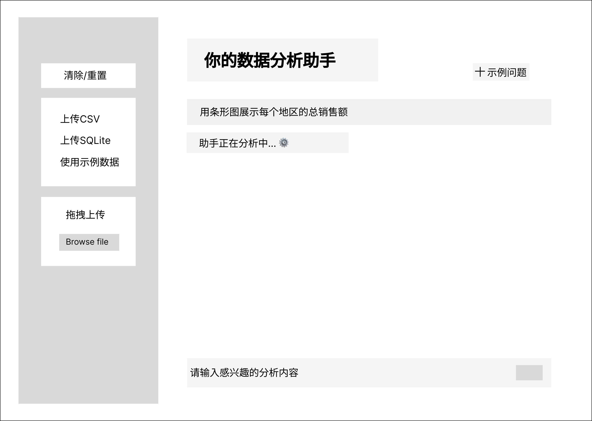
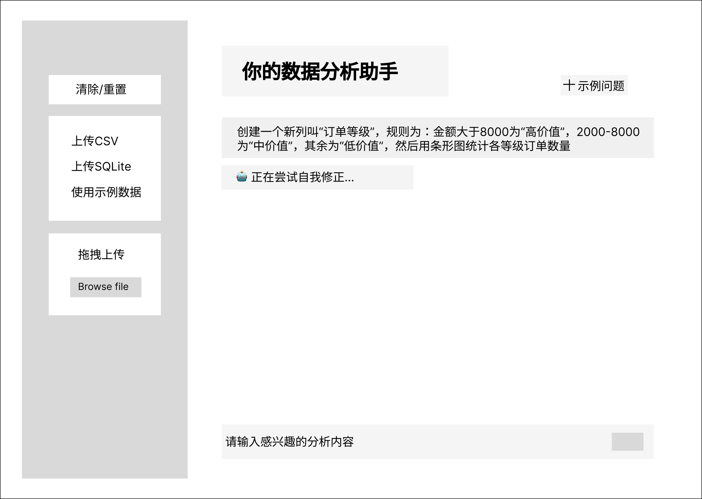
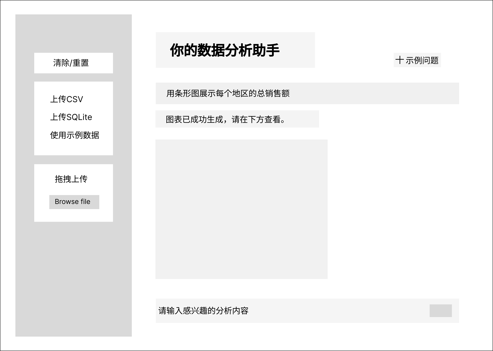

# InsightAgent: 从0到1构建可信赖的AI数据分析系统

> **产品愿景：** 让每一位业务人员都能拥有一个安全、可靠、无需代码的AI数据分析伙伴，将数据洞察的门槛降至为零。

[](https://github.com/your-username/InsightAgent/)
[](https://www.python.org/downloads/)
[](https://opensource.org/licenses/MIT)
[](https://langchain.com/)

---

## 1. 🎯 产品洞察：AI数据分析的“信任基石”

### 1.1 用户画像：渴望数据赋能的“业务执行者”

这个项目的核心目标用户，是那些身处业务一线、渴望利用数据但被编程门槛阻碍的**“业务执行者”**（例如，市场运营、内容策略、初级产品经理等）。

*   **他们的目标：** 快速获取数据支持日常决策，验证业务效果，提升工作效率。
*   **他们的困境：** 拥有业务理解力，但缺乏编程技能。他们知道自己需要什么数据，却无法独立、高效地获取。

### 1.2 核心痛点：AI工具的“信任悖论”

AI工具的出现看似解决了问题，但却引入了一个更深的“信任悖论”：

**对于非技术背景的用户来说，他们无法独立验证AI生成结果的准确性。因此，一旦AI犯错一次，就会导致用户对工具的信任彻底崩溃。**

*   **场景A (SQL查询):** 用户让AI查询“上周新用户数”。AI返回一个数字。用户无法确定这个数字是AI正确查询得来的，还是因为AI“幻觉”了一个错误的列名而编造的。这种不确定性让用户不敢在报告中引用这个数字。
*   **场景B (Python分析):** 用户让AI进行多步分析。AI在中间某个步骤悄悄犯错（例如，错误地过滤了数据），导致最终的可视化结果完全失真。用户基于这个错误图表做出了错误的业务判断。

**结论：** 对于这个用户群体，**可靠性不是“锦上添花”，而是“生死存亡”的基石**。一个偶尔犯错的AI工具，比没有工具更糟糕，因为它会主动误导用户。

### 1.3 产品使命：构建一个“100%可信赖”的分析助手

基于以上洞察，我为这个项目定义了清晰且不妥协的产品使命：**在为用户提供便利之前，必须首先建立绝对的可靠性。**

为了实现这个使命，我必须解决两个核心技术挑战，确保AI在执行两类关键任务时，其行为是**可预测且可验证的**：

| 任务类型 | 核心挑战 (如何建立用户的信任) |
| :--- | :--- |
| **🔎 精确数据查询 (SQL)** | **杜绝幻觉，保证100%准确。** AI的行为必须被严格约束，其每一步操作都必须基于数据库的真实结构，不能有任何自由发挥的空间。 |
| **📊 结构化分析 (Python)** | **过程透明，结果可复现。** AI的分析流程必须被分解，让用户（或辅助验证人员）能够理解其每一步操作，确保最终结果的逻辑链条是正确的。 |


**最终，我的核心产品挑战可以归结为：** 我们能否通过精巧的系统架构设计，将AI的“黑盒”转变为“白盒”，为非技术用户提供一个他们敢于依赖和信赖的分析工具？


## 2. 💡 解决方案：一场追求“工程级可靠性”的架构攻坚

### 2.1 Python Agent: 应对“复杂性”的“三层防御”架构

对于需要多步推理和数据操作的Python任务，我设计了一套容错性极高的架构。

*   **产品价值：** 解决复杂任务的“黑盒”与“不可靠”问题，让分析路径透明且稳健。
*   **架构实现：**
    1.  **规划层 (Plan):** 将用户请求分解为线性的Pandas代码步骤。
    2.  **执行与校正层 (Execute & Correct):** 逐一执行代码，并通过“AI自我修正”循环处理运行时错误。
    3.  **认知层 (Knowledge):** 注入专业分析知识，使其能智能选择图表、拒绝不合理请求。

---

### 2.2 SQL Agent: 追求“确定性”的“强约束ReAct”架构

对于“是”或“否”明确的SQL查询任务，可靠性是第一要务。为此，我没有使用通用ReAct，而是设计了一套带有“黄金法则”的强约束模板。

*   **产品价值：** 解决AI在数据库查询中的“幻觉”问题，确保每一次查询都精准无误。
*   **架构实现：**
    *   **强制行为模式：** 通过精心设计的Prompt，我为SQL Agent设定了**不可违背的“黄金法则”**：`1. 必须先查表 -> 2. 必须先查Schema -> 3. 严禁使用未见过的表/列名`。
    *   **结果：** 这种强约束极大地压缩了LLM“自由发挥”的空间，使其行为变得高度可预测。

<br>

<details>
<summary><strong>💡 架构核心：一场“四重试炼”驱动的自研引擎之路 (Technical Deep Dive)</strong></summary>

这个项目的核心——`PlanAndExecuteExecutor`——并非一蹴而就。它是我在经历了四次主流Agent方案的失败尝试后，在“无路可走”的情况下，回归第一性原理，最终创造出的解决方案。这段真实的“踩坑”之旅，让我对Agent的内在机制有了极其深刻的理解。

#### **第一阶段：标准Agent的“黑盒”困境**

*   **尝试 #1: `create_pandas_dataframe_agent`**
    *   **遇到的瓶颈：** 我发现，当我试图注入自定义的Prompt（例如，增加“自我修正”的指令）时，会与框架内置的Prompt产生严重冲突，导致Agent无法生成任何有效结果。**结论：标准Agent过于封装，无法进行深度定制。**

#### **第二阶段：Tool-Calling模式的“失控”难题**

*   **尝试 #2: 自定义`Tool-Calling` Agent**
    *   **遇到的瓶颈：** 这个模式虽然更灵活，但我遇到了两个致命问题：
        1.  **指令漂移：** 我要求它“画图”，它却只“生成了画图的代码”，而没有真正地调用绘图工具。
        2.  **随机循环：** 在某些情况下，模型会陷入一个无法退出的、重复调用工具的循环中，且框架缺乏可靠的强制退出机制。

#### **第三阶段：ReAct模式的“格式与幻觉”之痛**

*   **尝试 #3: 通用ReAct Agent**
    *   **遇到的瓶颈：** 无论我如何通过System Prompt进行约束，LLM存在生成正确的代码，但是无法获取Observation, 执行器不识别json格式的输出，一直陷入循环过程。**结论：LLM的输出格式具有强大的“惯性”，单纯的指令有时无法约束。**

*   **尝试 #4: 深度定制ReAct Agent**
    *   **遇到的瓶颈：** 在解决了部分格式问题后，我遇到了一个更诡异、更底层的现象——Agent会**不等待工具的真实执行结果(Observation)，直接“制造”一个幻觉出来的结果**，然后继续下一步。这使得整个执行链变得完全不可信。

#### **最终的顿悟与解决方案：自研极简执行器**

在经历了这四次试炼后，我得出一个关键结论：**所有问题的根源，在于我将“思考规划”和“工具执行”这两项任务，都过度地委托给了不确定性的LLM。**

因此，我决定进行一次彻底的“权力分离”：
*   **LLM的唯一职责：思考与规划。** 我只让LLM做它最擅长的事——将用户的自然语言请求，翻译成一个**简单的、确定性的Python代码步骤列表**。
*   **我的代码的唯一职责：控制与执行。** 我亲手编写了一个**极简的、确定性的`PlanAndExecuteExecutor`**。它的逻辑非常简单：
    1.  接收LLM生成的代码列表。
    2.  用一个`for`循环，严格地、按顺序地执行列表中的每一行代码。
    3.  在循环中，用`try-except`捕获任何错误，并注入我设计的“AI自我修正”逻辑。

**这个从“复杂委托”到“极简控制”的转变，不仅解决了之前遇到的所有问题（黑盒、失控、幻觉），更让我确立了我的核心产品哲学：“用100%确定性的代码架构，去驾驭和约束充满不确定性的AI模型。”**

</details>

### 2.3 产品体验设计：将“后端可靠性”转化为“前端信任感”

在我成功地通过后端架构，将SQL Agent的成功率提升至100%，并将Python Agent的**执行成功率**也提升至接近100%之后，我面临了一个新的**产品设计问题**：

**“如何让用户‘感知’到这份来之不易的后端可靠性，从而真正地信任这个产品？”**

这个思考，驱动了我后续的用户体验设计。我意识到，仅仅展示最终的正确结果是不够的，**展示系统在遇到困难时“努力解决问题”的过程，更能建立信任**。

因此，我设计了以下的核心用户旅程：

| **1. 初始蓝图** | **2. “自我修正”关键时刻** | **3. 可靠的结果交付** |
| :---: | :---: | :---: |
|  |  |  |
| **设计理念：明确范围**| **设计理念：建立信任** | **设计理念：价值闭环** |

## 3. 📈 数据驱动的迭代与验证：追求极致的可靠性

为了科学地验证我的架构选择，我创建了一个包含SQL和Python两类共15个用例的“黄金测试集”，并记录了详细的迭代过程。

### 3.1 Python Agent 的进化之路

| 迭代版本 | 核心架构 | 成功率 (Python Test Cases) | 关键洞察 |
| :--- | :--- | :---: | :--- |
| **V1.0** | 基线：单步 ReAct | **66.7%** (10/15) | **证明了通用框架的局限性**：在多步推理时极易失败。 |
| **V2.0** | **“三层防御”架构** | **87.0%** (13/15) | **验证了架构的优越性**：结构化流程能有效管理AI的不确定性。|

### 3.2 SQL Agent 的极致可靠性

| 迭代版本 | 核心架构 | 成功率 (SQL Test Cases) | 关键洞察 |
| :--- | :--- | :---: | :--- |
| **V1.0** | 基线：约束ReAct | 93% (14/15) | **发现了“过度自由”的问题**：约束ReAct给了LLM犯错空间。 |
| **V2.0** | **“强约束ReAct”架构** | **100%** （15/15）| **证明了“约束即能力”**：在精确任务中，通过Prompt工程限制AI是提升可靠性的最佳途径。|

### 3.3 关键洞察：发现真正的瓶颈

在V2.0版本中，SQL Agent凭借其“强约束”设计，率先达到了100%的成功率，证明了在精确任务中“约束即能力”的正确性。

更有价值的发现来自于对Python Agent **13%失败案例的深度根因分析**：
我发现，这些失败**并非源于我的“三层防御”架构执行出错**——实际上，在所有“有意义的”问题上，它的执行成功率是100%的。所有的失败，都源于**用户输入的问题本身是无意义的或基于错误假设的**（例如，要求分析一个不存在的数据类型）。

**这个洞察让我得出一个关键结论：** 我已经通过架构设计，在**“执行层”**建立了坚固的可靠性基石。现在，提升产品整体成功率的瓶颈，已经从**“后端执行”**转移到了**“前端交互”**。

<details>
<summary><strong>点击查看：完整的黄金测试集评测记录</strong></summary>

| 任务类型 | 难度 | 类型 | 用户问题 | V1.0 结果 | V2.0 结果 | 备注 |

| Python | 简单 | 基础绘图 | "用条形图展示每个地区的总销售额。" | ✅ 成功 | ✅ 成功 | |
| Python | 简单 | 基础绘图 | "用饼图展示不同支付方式的使用占比。" | ✅ 成功 | ✅ 成功 | |
| Python | 简单 | 基础数据 | "找出数据中单价最高的产品是什么？" | ✅ 成功 | ✅ 成功 | |
| Python | 中等 | 多样化绘图 | "用折线图分析2024年每个月的总销售额趋势。" | ✅ 成功 | ✅ 成功 | |
| Python | 中等 | 多样化绘图 | "用水平条形图展示销量最高的前5个产品。" | ✅ 成功 | ✅ 成功 | |
| Python | 中等 | 图表定制 | "生成各产品类别的销售额占比饼图，并突出显示“电子产品”这一块。" | ✅ 成功 | ✅ 成功 | |
| Python | 中等 | 图表定制 | "生成各地区平均订单金额的条形图，并添加标题“各地区平均订单金额对比”和Y轴标签“平均金额（元）”。" | ✅ 成功 | ✅ 成功 | |
| Python | 中等 | 数据处理 | "计算并展示每个产品类别的平均折扣率（假设折扣率为 (1 - total_amount / (quantity * unit_price)))。 " | ✅ 成功 | ✅ 成功 | |
| Python | 困难 | 复杂数据处理 | "创建一个新列叫“订单等级”，规则为：金额大于8000为“高价值”，2000-8000为“中价值”，其余为“低价值”，然后用条形图统计各等级订单数量。" | ✅ 成功 | ✅ 成功 | |
| Python | 困难 | 组合图表 | "在一张图里，用条形图展示各地区的总销售额，并用折线图展示各地区的平均订单金额。" | ✅ 成功 | ✅ 成功 | |
| Python | 困难 | 逻辑推理 | "分析是否存在某些产品只在特定地区销售的现象。" | ✅ 成功 | ✅ 成功 | |
| Python | 陷阱 | 不存在的数据 | "请绘制“智能手表”的销售趋势图。" | ❌ 失败 | ✅ 成功 | 无法判断不存在的数据 |
| Python | 陷阱 | 不存在的列 | "请分析顾客年龄与消费金额的关系。" | ✅ 成功 | ✅ 成功 | |
| Python | 陷阱 | 不合理请求 | "请用饼图展示每个订单ID的销售额。" | ❌ 失败 | ✅ 成功 | 无法识别不合理问题 |
| Python | 陷阱 | 隐性类型转换 | "统计每个季度的销售额。" | ✅ 成功 | ✅ 成功 | |
| SQL | 简单 | 基础查询 | "华南地区有多少条订单记录？ " | ✅ 成功 | ✅ 成功 | |
| SQL | 简单 | 基础查询 | "列出所有属于“电子产品”类别的订单。" | ✅ 成功 | ✅ 成功 | |
| SQL | 简单 | 基础查询 | "订单ID为10010的总金额是多少？" | ✅ 成功 | ✅ 成功 | |
| SQL | 中等 | 聚合 | "计算所有订单的总销售额。  " | ✅ 成功 | ✅ 成功 | |
| SQL | 中等 | 聚合 | "平均每个订单的销售额是多少？ " | ✅ 成功 | ✅ 成功 | |
| SQL | 中等 | 分组聚合 | "统计每个产品类别的总销售额。" | ✅ 成功 | ✅ 成功 | |
| SQL | 中等 | 分组聚合 | "哪个地区的平均订单金额最高？" | ✅ 成功 | ✅ 成功 | |
| SQL | 中等 | 排序 | "列出销售额最高的5个产品名称及其销售额。" | ✅ 成功 | ✅ 成功 | |
| SQL | 中等 | 条件 | "找出所有通过“支付宝”支付且金额大于5000的订单ID。" | ✅ 成功 | ✅ 成功 | |
| SQL | 困难 | 复杂聚合 | "统计2024年下半年，每个支付方式的使用次数。 " | ✅ 成功 | ✅ 成功 | |
| SQL | 困难 | 复杂聚合 | "找出客户ID为125的这位客户，购买最多的产品类别是什么？ " | ✅ 成功 | ✅ 成功 | |
| SQL | 困难 | 逻辑推理 | "购买了“智能手机 Pro”的客户，平均消费总额是多少？ " | ✅ 成功 | ✅ 成功 | |
| SQL | 陷阱 | 不存在的数据 | "查询“西北”地区的所有订单。 " | ✅ 成功 | ✅ 成功 | |
| SQL | 陷阱 | 模糊问题 | "哪个产品最受欢迎？" | ✅ 成功 | ✅ 成功 | |
| SQL | 陷阱 | 列名混淆 | "统计每个客户的平均订单数。 " | ✅ 成功 | ✅ 成功 | |

</details>


## 4. 🚀 成果与未来规划

### 4.1 最终产品演示
 

### 4.2 产品路线图：从“专家团队”到“智能大脑”

InsightAgent的MVP成功验证了“专家Agent”模式的有效性。我的下一步规划，是将这个“专家团队”升级为一个拥有“智能大脑”的、能够自主协作的分析系统。

---

### 🚀 第一步 (Next Step): **构建“智能交互层”，迈向100%端到端成功率**

*   **要解决的问题:** 当前系统13%的失败，全部源于对“无意义”用户问题的被动执行。这是产品体验的最大瓶颈。
*   **我的解决方案 (产品/技术):** 开发一个 **“智能路由与校验Agent” (Intelligent Router & Validator Agent)**，作为所有用户请求的**第一道关卡**。
    *   **核心职责 (前置校验与引导):** 在将任务交给执行Agent之前，**快速校验问题的合理性**。如果问题无意义，它不会直接拒绝，而是会**主动与用户进行澄清式对话 (Clarification Dialogue)**，例如：“数据中没有‘年龄’列，但有‘出生日期’列，您是想分析基于出生日期的年龄分布吗？”
    *   **次要职责 (意图识别与路由):** 将通过校验的、有意义的问题，无缝地路由给最合适的专家Agent（Python或SQL）。
*   **目标指标:** **将端到端的用户任务成功率提升至100%**，从根本上解决“垃圾输入，垃圾输出”的问题。

---

### 🤖 第二步 (Mid-Term): **引入RAG，让交互与执行更“懂”业务**

*   **要解决的问题:** 在“可靠”和“好用”的基础上，进一步提升Agent的“智能”与“业务贴合度”。
*   **我的方案:** 为“智能交互层”和“执行内核”同时配备一个基于**RAG**的**“长期记忆”知识库**。
    *   **赋能交互层:** RAG可以帮助路由Agent进行**更高质量的用户引导**，例如，推荐与用户问题相关的、历史上曾被问过的优质问题。
    *   **赋能执行层:** RAG可以为执行Agent提供精准的业务上下文，使其生成的分析计划和代码**更懂业务**。
*   **产品价值:** 使系统能应对真实商业世界中的、需要深度领域知识的复杂分析任务。

---

### 🌌 第三步 (Long-Term): **构建“语义层”，实现平台化与个性化**

*   **要解决的“规模化”挑战:**
    1.  **可维护性:** 当业务逻辑变化时（例如，一个指标的计算公式改变），我们不想去修改上百个分散的、写死的Prompt模板。
    2.  **可扩展性:** 如何让不同业务团队（如市场部、产品部）能低代码地定义他们自己专属的分析逻辑和术语？
*   **我的解决方案 (产品/技术):** 引入**“语义层 (Semantic Layer)”**和**“动态提示词模板库 (Dynamic Prompt Template Library)”**，将InsightAgent从一个“产品”升级为一个“平台”。
*   **最终愿景:** 将InsightAgent打造为一个**开放的、可组合的智能分析生态**。业务专家负责注入“知识”（语义层），AI Agent负责提供“智能”（执行与分析），共同创造价值。
      
## 5. 🧠 我的核心思考

> 1.  **没有银弹，只有适配 (No Silver Bullet, Only Fit):** 最好的Agent架构不存在，只存在最适合特定任务的架构。产品经理的核心是洞察任务本质，并做出正确的技术选型。
> 2.  **约束即能力 (Constraint as a Capability):** 在追求AI智能的同时，我们必须学会设计“缰绳”。对于需要高确定性的任务，精巧的约束比无尽的“自由”更强大。
> 3.  **系统大于个体 (System over Individual):** 构建一个由多个“70分”的专家Agent组成的、协同工作的系统，其价值远大于试图打造一个“90分”的通用全能Agent。


## 🛠️ 如何运行

1.  **克隆仓库**
    ```bash
    git clone https://github.com/your-username/InsightAgent.git
    cd InsightAgent
    ```

2.  **安装依赖**
    ```bash
    pip install -r requirements.txt
    ```

3.  **设置环境变量**
    *   复制 `.env.example` 文件为 `.env`
    *   在 `.env` 文件中填入您的 ZHIPUAI_API_KEY
    ```
    ZHIPUAI_API_KEY="your_api_key_here"
    ```

4.  **启动应用**
    ```bash
    streamlit run app.py
    ```

## 💻 技术栈

*   **语言**: Python 3.12+
*   **核心框架**: LangChain, Streamlit
*   **数据处理**: Pandas
*   **LLM**: ZhipuAI (glm-4-air-250414)

---

**欢迎 Star, Fork, 和提出 Issue！**
